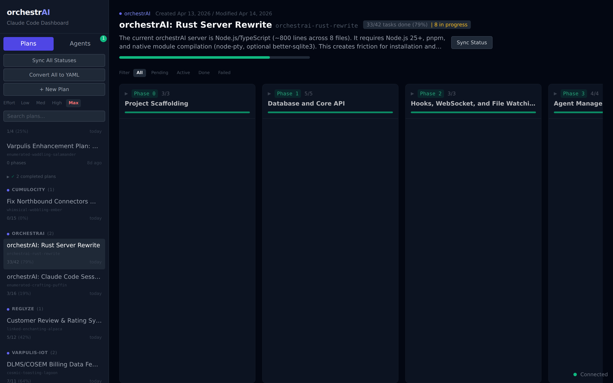
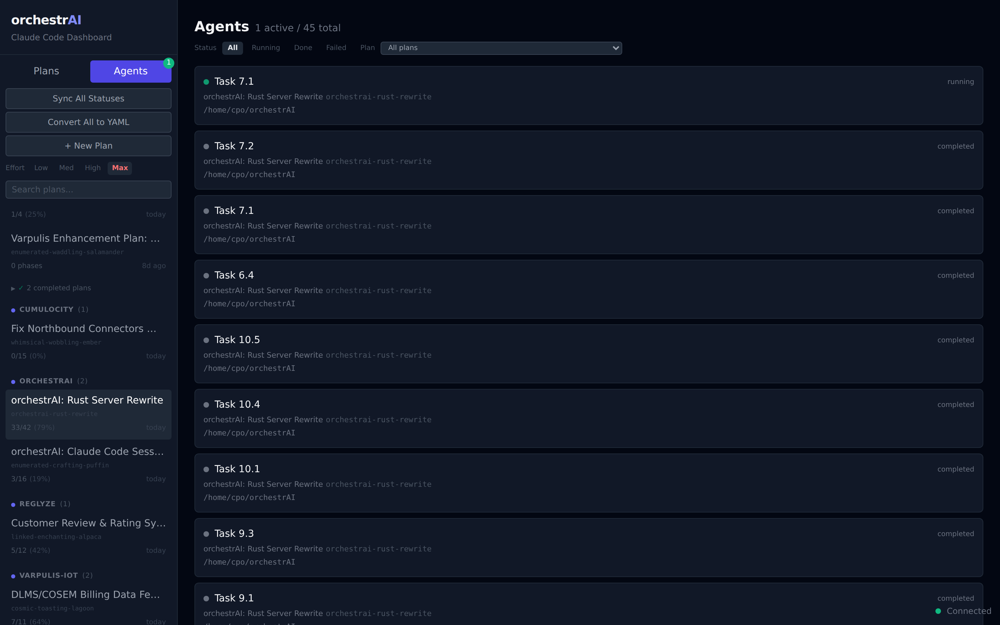
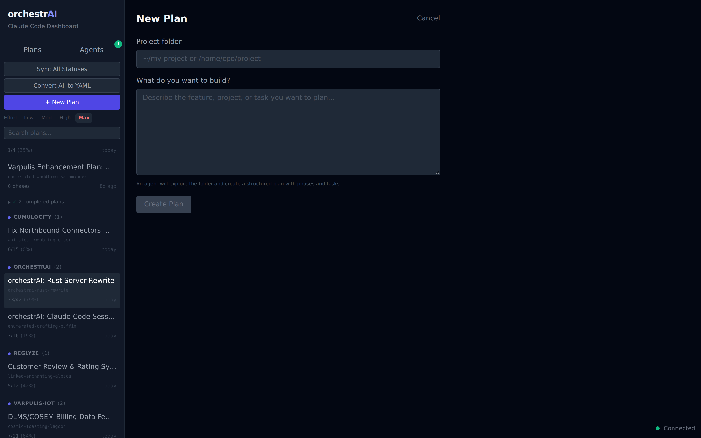
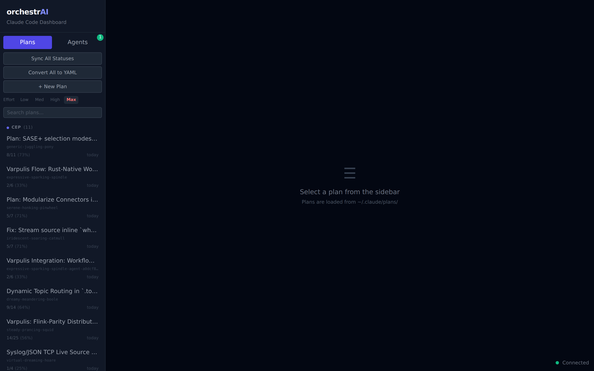

# orchestrAI

Real-time web dashboard for visualizing Claude Code plans, agents, and tasks.

orchestrAI watches your `~/.claude` directory for plan files and hook events, displays them in a live dashboard, and lets you manage agent sessions — all from a single self-contained binary.

## Screenshots

**Plan Board** — Kanban-style phases with task cards, status tracking, and progress bars:



**Agents** — Track all running and completed agents with filters:



**New Plan** — Describe what to build, pick a folder, and an agent creates a structured plan:



**Sidebar** — Plans grouped by project, effort selector, sync/convert actions:



## Features

- **Plan Board**: Parses `~/.claude/plans/*.md` and `.yaml` into Kanban phases/tasks with progress bars
- **Auto-status detection**: Scans project files and git history to infer task completion
- **Interactive agents**: Start/Continue/Retry tasks via real Claude Code terminal sessions (tmux + xterm.js)
- **Check agents**: One-click verification — spawns a read-only agent to check if a task is done
- **Agent persistence**: Agents survive server restarts (tmux sessions auto-reattach)
- **Effort control**: Global effort level selector (Low/Med/High/Max) for all spawned agents
- **Project inference**: Automatically links plans to project directories
- **YAML plans**: Structured plan format with conversion from markdown
- **Real-time updates**: WebSocket broadcasts for plan changes, agent output, and status updates
- **Embedded frontend**: Single binary serves the React dashboard — no separate web server needed

## Build from source

Requires Rust 1.85+, Node.js 20+, and pnpm.

```sh
# Build frontend
pnpm --filter @orchestrai/web build

# Build server (embeds frontend)
cd server-rs && cargo build --release
```

Binary: `server-rs/target/release/orchestrai-server`

## Usage

```sh
orchestrai-server [OPTIONS]
```

| Flag           | Default     | Description                                          |
|----------------|-------------|------------------------------------------------------|
| `--port`       | `3100`      | HTTP port                                            |
| `--effort`     | `high`      | Effort level for agents (`low`, `medium`, `high`, `max`) |
| `--claude-dir` | `~/.claude` | Path to `.claude` directory                          |

Open `http://localhost:3100` in your browser.

## Project structure

```
orchestrAI/
  server-rs/      Rust server (Axum, rusqlite, portable-pty, tmux)
  web/            React frontend (Vite, Tailwind, xterm.js)
```

## License

MIT
