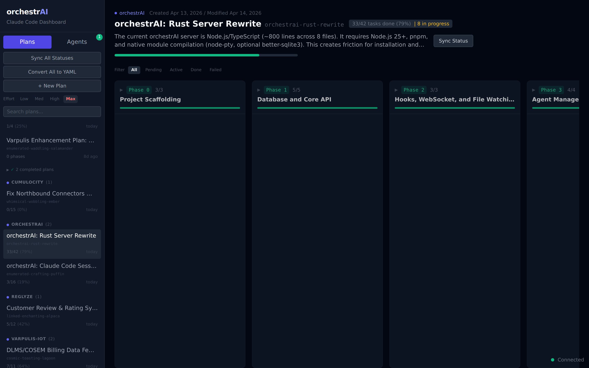
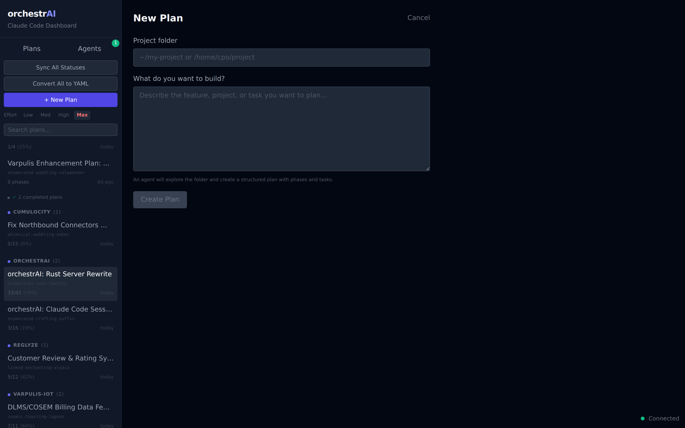

# Branchwork

**See what your agents are doing — against the plan.** Agents orchestrate themselves; Branchwork is the layer they report to: shared plan state, scoped project practices served at the moment a task starts, and a live dashboard that shows declared progress next to observed ground truth (commits, PRs, CI). The agent drives. Branchwork knows, advises and shows.


Plans live as YAML in `~/.claude/plans/`. Any MCP-speaking agent — a Claude Code session and its sub-agents, a runner, Bob Shell — connects to the Branchwork MCP server and:

- **declares** where it is (`update_task_status` with its agent label + artifact links — PR, commit, CI run);
- **asks** for task context (`get_task_context`: the task's spec, prior learnings, **and every project practice whose scope matches the files it is about to touch** — your org's hard-won rules, injected exactly when they're needed);
- **teaches** (`practice_add`: promote a recurring learning into a standing, scoped rule).

Mark a plan `mode: observe` and Branchwork tracks a foreign orchestrator without driving anything — no spawn, no gates on your worktree, pure visibility. Practices are advisory by design: CI stays the enforcement layer.

**Managed mode still exists** for when you want Branchwork to drive: every task has a Start button that spins up a Claude agent on a dedicated git branch — you watch it work, type to it, review the diff and merge from the browser (Claude Code today, Aider/Codex/Gemini as drivers). Ships as a single ~15 MB Rust binary. No Node, no Docker, no daemon to install separately.

## Screenshots

### Plan board — collapsible phases, live status


### Agent terminal — full Claude Code session in the browser


### New plan — describe, pick a folder, an agent creates the plan


### Sidebar — projects, driver auth status, effort level


## Install

Pick one. All three land the same `branchwork-server` binary on your `PATH`. See [docs/quickstart.md](docs/quickstart.md) for the full five-minute walkthrough.

```sh
# Shell installer (Linux / macOS)
curl -fsSL https://raw.githubusercontent.com/branchwork/branchwork/master/install.sh | sh

# Build from source (Rust 1.85+, Node.js 20+, pnpm)
pnpm --filter @branchwork/web build && cd server-rs && cargo build --release

# Run
branchwork-server     # binds http://localhost:3100
```

Open <http://localhost:3100> in any browser on your network.

## Documentation

The full documentation set lives under [`docs/`](docs/README.md).

- [**Quickstart**](docs/quickstart.md) — five-minute self-hosted path: install, run, first plan, session-persistence proof.
- [**User guide**](docs/user-guide.md) — every dashboard surface: plans, tasks, agents, drivers, git flow, cost tracking, CI, auto-mode, notifications.
- [**Architecture overview**](docs/architecture/overview.md) — the three binaries (`branchwork-server`, `session_daemon`, `branchwork-runner`), wire protocols, persistence model.
- [**Operations**](docs/README.md#operations) — [self-hosted](docs/operations/self-hosted.md), [SaaS runner](docs/operations/saas-runner.md), [Docker](docs/operations/docker.md), [Helm + Terraform](docs/operations/helm-terraform.md), [upgrades and migrations](docs/operations/upgrades-and-migrations.md).
- [**Reference**](docs/README.md#reference) — [CLI flags](docs/reference/cli.md), [configuration](docs/reference/configuration.md), [plan schema](docs/reference/plan-schema.md), [drivers](docs/reference/drivers.md).
- [**Troubleshooting**](docs/troubleshooting.md) and [**glossary**](docs/glossary.md).
- [**Bob Shell integration**](docs/bob-shell-integration.md) — connect Bob Shell to Branchwork's MCP server.

## Project structure

```
Branchwork/
  server-rs/      Rust server (Axum, rusqlite, portable-pty, interprocess)
  web/            React frontend (Vite, Tailwind, xterm.js, Zustand)
  deploy/         Dockerfile, compose overlays, Helm chart, Terraform module
  docs/           Documentation (start at docs/README.md)
  screenshots/    Dashboard screenshots + demo recording
```

## License

MIT
