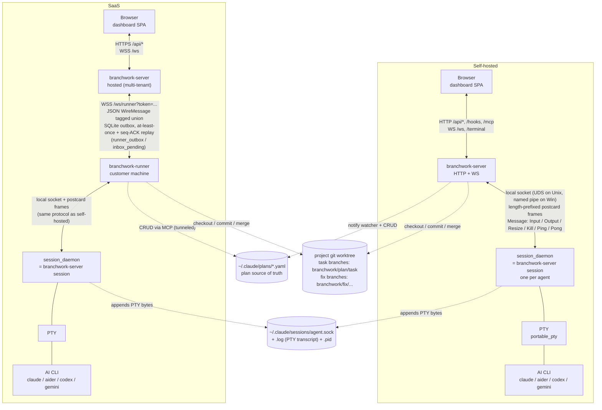

# Architecture overview

Branchwork ships as three cooperating binaries:

- **`branchwork-server`** — the dashboard. Serves the SPA, the HTTP API
  (`/api/*`, `/hooks`, `/mcp`), and the WebSockets (`/ws` for dashboard
  events, `/terminal` for xterm.js, `/ws/runner` for remote runners in
  SaaS mode). Also ships the `branchwork-server session` subcommand.
- **`session_daemon`** — one per agent. Owns a PTY, forwards bytes over a
  local IPC socket, and survives server restarts. `session_daemon` and
  `branchwork-server session` are the same code (see
  [`supervisor.rs`](../../server-rs/src/agents/supervisor.rs)) invoked
  two different ways.
- **`branchwork-runner`** — SaaS only. Lives on the customer's machine,
  connects outbound to the hosted dashboard over an authenticated
  WebSocket, and reuses `branchwork-server session` as its per-agent
  supervisor.

The diagram below shows both deployment shapes on one canvas so the
runner's place in the SaaS path is easy to compare against the
self-hosted path.

## Component diagram

## Legend

| Line | Meaning |
|------|---------|
| Solid arrow `<-->` | Live bidirectional channel (HTTP, WebSocket, or local socket). |
| Solid line `---` | In-process handoff (file descriptor, spawn). |
| Dashed arrow `-.->` | Filesystem read or write (not a live connection). |

## Key invariants the diagram encodes

- **One protocol, two transports.** The session IPC frame format
  (4-byte big-endian length + postcard-encoded
  [`Message`](../../server-rs/src/agents/session_protocol.rs) payload,
  capped at 8 MiB) is identical in both deployments. Only the hop that
  reaches it differs: the dashboard server talks to the daemon directly
  in self-hosted mode, whereas in SaaS the runner is the client.
- **Daemons outlive the server.** The `session_daemon` fork+setsids
  itself on Unix (or is spawned with `DETACHED_PROCESS` on Windows) so
  agent sessions survive a server restart and are reattached from the
  `<socket>.log` transcript.
- **Plans are files, not rows.** Every dashboard reads and writes
  `~/.claude/plans/*.yaml` as the source of truth; SQLite stores
  runtime state (agents, task status, cost, outbox) but not the plan
  definition itself.
- **Task work is a git branch.** Agents run on a dedicated branch
  (`branchwork/<plan>/<task>`), and the merge button is gated on the
  branch having commits — nothing is persisted through the dashboard
  alone.
- **SaaS adds a WebSocket hop, not a new protocol.** The
  `branchwork-runner` speaks a JSON
  [`WireMessage`](../../server-rs/src/saas/runner_protocol.rs) envelope
  upstream; downstream it reuses `branchwork-server session` verbatim.

## See also

- [architecture/server.md](server.md) _(stub)_ — dashboard internals.
- [architecture/session-daemon.md](session-daemon.md) _(stub)_ — PTY
  and reattach details.
- [architecture/runner.md](runner.md) _(stub)_ — runner lifecycle,
  outbox, reconnect.
- [architecture/protocols.md](protocols.md) _(stub)_ — frame formats
  and WS event vocabulary.
- [architecture/persistence.md](persistence.md) _(stub)_ — SQLite /
  Postgres schema and what survives restart.
